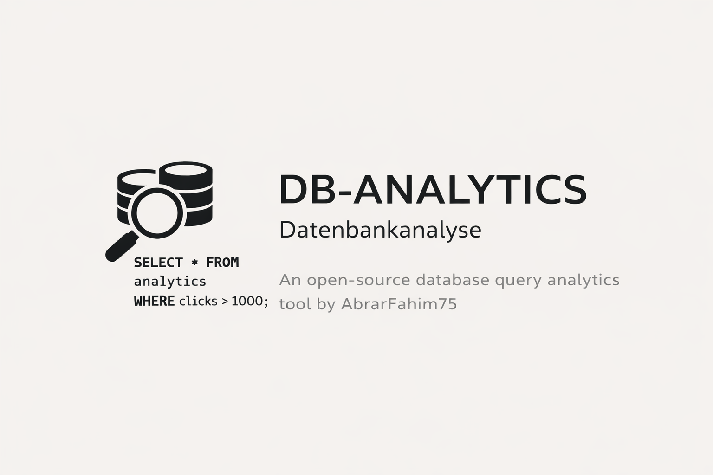

<p align="center">
  
</p>

# Database Analytics Systems
SQL • Database Design • Data Analytics • Query Optimization

A structured repository for learning and practicing **SQL, database management, and data analytics**.
This repository combines **academic coursework from HAW Hamburg** with **industry-oriented SQL practices**, including schema design, data manipulation, analytical queries, and performance optimization.

The goal of this project is to build a **strong foundation in relational databases and SQL**, while organizing exercises and examples in a way that reflects **real-world data engineering and analytics workflows**.

---

## Quick Start
```bash
# 1. Install PostgreSQL (v14+)

# 2. Create a database
createdb db_analytics

# 3. Load a sample dataset
psql db_analytics < datasets/shipping.sql

# 4. Start querying
psql db_analytics
```

---

## Repository Structure
```
db-analytics/
│
├── datasets/                # Sample datasets (shipping, chemistry, geography)
├── docs/                    # Notes on database concepts and SQL theory
│   ├── er-modeling.md
│   └── acid-transactions.md
├── schemas/                 # ER diagrams (Mermaid) and relational model definitions
├── labs/                    # Lab assignments from HAW Hamburg course
│   ├── lab1/                # DDL, DML, SQL queries
│   ├── lab2/                # ER diagrams, relational models
│   ├── lab3/                # Normalization, relational algebra
│   └── lab4/                # Transactions, views, triggers
│
├── sql/
│   ├── ddl/                 # Data Definition Language (CREATE, ALTER, DROP)
│   ├── dml/                 # Data Manipulation Language (INSERT, UPDATE, DELETE)
│   ├── queries/             # Core SQL queries and filtering examples
│   ├── joins/               # JOIN operations between tables
│   ├── aggregation/         # GROUP BY, HAVING, COUNT, SUM, AVG
│   ├── subqueries/          # Nested SQL queries
│   ├── views/               # CREATE VIEW, updatable views
│   ├── triggers/            # BEFORE, AFTER, INSTEAD OF triggers
│   ├── transactions/        # BEGIN, COMMIT, ROLLBACK, SAVEPOINT
│   ├── normalization/       # Functional dependencies, 1NF → 2NF → 3NF decomposition
│   ├── window-functions/    # Analytical SQL window functions (industry extension)
│   └── optimization/        # Query optimization and indexing strategies
│
├── projects/                # Larger integrated projects
├── LICENSE
└── README.md
```

---

## Topics Covered

This repository includes practice and examples for:

- SQL Fundamentals
- Data Definition Language (DDL)
- Data Manipulation Language (DML)
- Data Retrieval and Filtering
- JOIN operations (INNER, LEFT, RIGHT, FULL, CROSS)
- Aggregations and GROUP BY
- Subqueries (IN, EXISTS, correlated)
- Views and updatability
- Triggers (BEFORE, AFTER, INSTEAD OF)
- Transactions and ACID properties
- Normalization (1NF → 2NF → 3NF → BCNF)
- ER Modeling (Chen and MC notation)
- Window Functions (industry extension)
- Query Optimization and Indexing

---

## Purpose of This Repository

This project serves multiple purposes:

**Academic Learning**

- Support coursework related to databases and SQL
- Organize exercises and notes in a structured format
- Practice for examinations with worked examples

**Professional Skill Development**

- Practice SQL queries used in real-world analytics
- Understand relational database design
- Learn query optimization and performance techniques

**Portfolio Development**

- Demonstrate SQL and database skills
- Maintain a structured GitHub repository for interviews and job applications
---

## Technologies and Tools

* SQL
* Relational Databases (PostgreSQL / MySQL concepts)
* Git & GitHub for version control

---

## Author

**Md Abrar Fahim**
B.Sc. Information Engineering — HAW Hamburg
