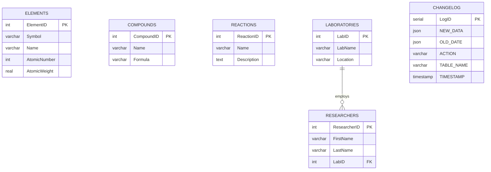

# Chemistry Database — ER Diagram

## Entity-Relationship Diagram (Mermaid)

## Relational Schema

- **ELEMENTS** (<u>ElementID</u>, Symbol, Name, AtomicNumber, AtomicWeight)
- **COMPOUNDS** (<u>CompoundID</u>, Name, Formula)
- **REACTIONS** (<u>ReactionID</u>, Name, Description)
- **LABORATORIES** (<u>LabID</u>, LabName, Location)
- **RESEARCHERS** (<u>ResearcherID</u>, FirstName, LastName, *LabID* → LABORATORIES)
- **CHANGELOG** (<u>LogID</u>, NEW_DATA, OLD_DATE, ACTION, TABLE_NAME, TIMESTAMP)
