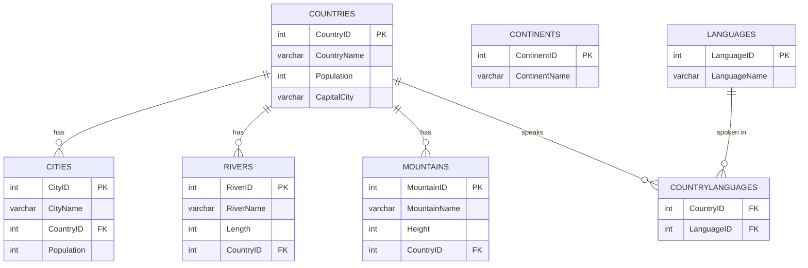

# Geography Database — ER Diagram

## Entity-Relationship Diagram (Mermaid)

## Relational Schema

- **COUNTRIES** (<u>CountryID</u>, CountryName, Population, CapitalCity)
- **CONTINENTS** (<u>ContinentID</u>, ContinentName)
- **CITIES** (<u>CityID</u>, CityName, *CountryID* → COUNTRIES, Population)
- **RIVERS** (<u>RiverID</u>, RiverName, Length, *CountryID* → COUNTRIES)
- **MOUNTAINS** (<u>MountainID</u>, MountainName, Height, *CountryID* → COUNTRIES)
- **LANGUAGES** (<u>LanguageID</u>, LanguageName)
- **COUNTRYLANGUAGES** (<u>*CountryID* → COUNTRIES, *LanguageID* → LANGUAGES</u>)
