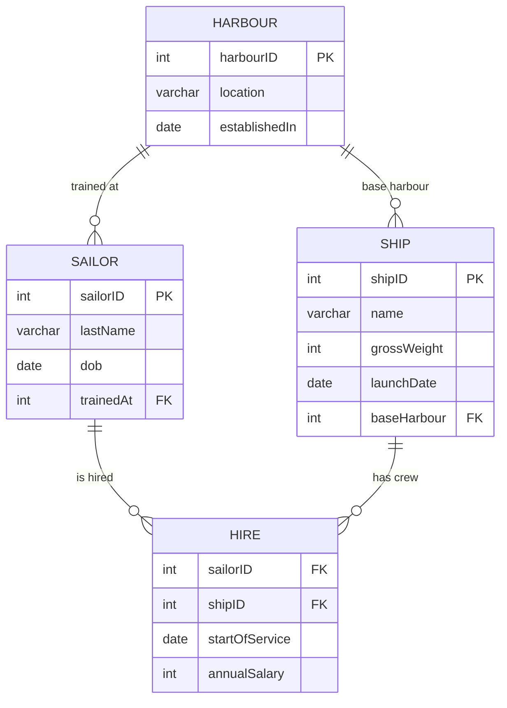

# Shipping Company — ER Diagram

## Entity-Relationship Diagram (Mermaid)

## Relational Schema

- **HARBOUR** (<u>harbourID</u>, location, establishedIn)
- **SAILOR** (<u>sailorID</u>, lastName, dob, *trainedAt* → HARBOUR)
- **SHIP** (<u>shipID</u>, name, grossWeight, launchDate, *baseHarbour* → HARBOUR)
- **HIRE** (<u>*sailorID* → SAILOR, *shipID* → SHIP</u>, startOfService, annualSalary)
